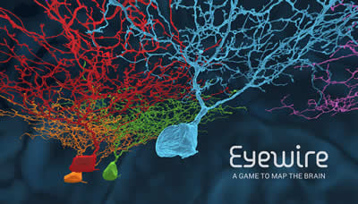

EyeWire Human Development &Data Insight

The human brain contains roughly 80 billion neurons connected by axons and dendrites. The retina consists of three neurons— a photoreceptor, a ganglion cell, and a bipolar cell— yet, the retina is one of the most complex systems in the human body. Knowledge about the inner- and inter-workings of these neurons remains relatively unexplored in neuroscience because of the volume of information required to understand how the brain is wired. To combat this volume of missing information, the Seung Lab of Princeton University created a citizen science platform with which humans can learn to map neurons and retinal cells: EyeWire. 

Neuroscientists at the Seung Lab developed EyeWire, an online tool that combines artificial intelligence and crowd-sourced data analysis in order to map the brain’s neurons and retinal cells. The human brain has the potential to learn the patterns of neurons without any formal scientific training, which is what makes the crowd-sourced data possible. Scientists recognize the human brain as the ultimate supercomputer, and they use its innate ability to recognize patterns in combination with machine learning to map neurons within the brain. 

The Seung Lab primarily focuses on mapping retinal cells, with the ultimate goal of creating an artificially intelligent system capable of mapping the entire human brain. EyeWire functions as a game in which users learn how to identify individual neurons and map them on a three-dimensional “cube.” The users of EyeWire examine a portion of the retina captured by two-photon microscopy. This image of retinal cells was stained to make the contrast between the neuron and non-neuron apparent to the human eye. As users progress through the game, artificial intelligence checks their work against its own, which helps to eliminate both human and machine error. 

The instructions for playing EyeWire are binary; players must identify which parts of the cube fall within a particular neuron, and which parts don’t. Users work layer by layer to map a three-dimensional image of the neuron. Similar to some crowd-sourced geospatial data, EyeWire combines results from multiple users in order to synthesize information and create the most accurate depiction of the neuron. EyeWire has drawn over 250,000 users from 150 countries to participate in this triumph of science that can only be achieved through the laborious process of mapping neuron systems by hand.

This wealth of data allows researchers to identify new cell types and synapses. Data sets obtained through EyeWire have applications in health care, medicine, and biology. This mass amount of information, which may one day be large enough to create accurate artificial intelligence to map neurons, would allow scientists to detect “miswirings” of the brain, such as those that indicate disorders such as autism and schizophrenia. The EyeWire team hopes to expand known information about specific retinal cells and broad classes of retinal cells. 

With this information, EyeWire aims to identify how humans and other mammals detect motion; this research would improve blindness therapy and the progression of retinal prosthetics. With enough human input, the artificial intelligence embedded into EyeWire can achieve accurate neuronal reconstruction. This research could accelerate identification and treatment for humans with these disorders and improve the quality of life and mental health for any afflicted person. EyeWire fills the gaps in information for neuroscientists aiming to surmount the issues of health and medicine related to the brain. 

