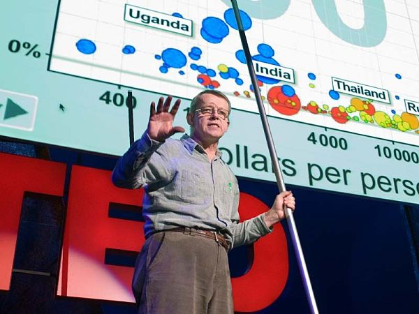

# Hans Rosling: The best stats you've ever seen
Anna Glass

Professor Frazier

DATA 150-01 Evolving Solutions

27 August, 2020

In the TED Talk, “The best stats you’ve ever seen,” Hans Rosling outlines a chronology of the relationship between development indicators and wealth. He provides rules and exceptions to the preconceived notions about the developing world by extrapolating hard-to-reach data and condensing it into geographic regions. Rosling finds several development indicators that are precursors to wealth, including social change to a market economy, access to demanded resources, lower child mortality rates, and, most recently, the number of Internet users per capita. Although there are several development indicators that predict an upturn in domestic wealth, Rosling places an emphasis on two in particular— domestic health as illustrated by child mortality rates, and social change as illustrated by social policy and internet usage per capita. 

According to Rosling, the relationship between health and wealth works one way. Health is a precursor to wealth, but not vice versa. Rosling comments, “Health cannot be bought at the supermarket. You have to invest in health. You have to get kids into schooling. You have to train health staff. You have to educate the population.” Although Rosling gave his TED Talk in 2006, this principle applies to the contemporary example of the COVID-19 pandemic responses. The international community has lauded states that imposed strict measures to improve domestic health at the short-term expense of the economy, such as New Zealand and South Korea. Inversely, countries that prioritized economic reopening over stable domestic health, such as Trump’s United States and Bolsonaro’s Brazil, have suffered in both the economic and health sectors. The history of political responses to pandemics presents the same theory of “health before wealth” that Rosling urges. 

Social change, which includes the widespread adoption of Internet usage per capita, precedes economic growth. As Rosling mentions, Vietnam began to implement family planning in 1964, and adopted a market economy as opposed to a Communist economy in the 1980s. Asian poverty was once a major concern on the international scale, but these social changes have been the precursor to economic growth and reduced poverty in South Asia. I resonated with Rosling’s argument that interdependence and social change influence economic growth. He adopts the liberalist paradigm of international relations when he gives the example, “This is Mao Zedong. He brought health to China. And then he died. And then Deng Xiaoping came and brought money to China, and brought them into the mainstream again.” Rosling argues that domestic economies ebb and flow in accordance with the political leaders and the social policies that they implement. Internet usage reflects both spending capabilities and social attitudes toward freedom of information. Its role as a development indicator remains vital as we move into an increasingly digital world. 

These data sets represent a vital tool for political and economic analysts as they attempt to predict economic changes. As Rosling declares, “We are liberating UN data,” which proves the breadth of its potential to illuminate development indicators on the individual and world scales.

